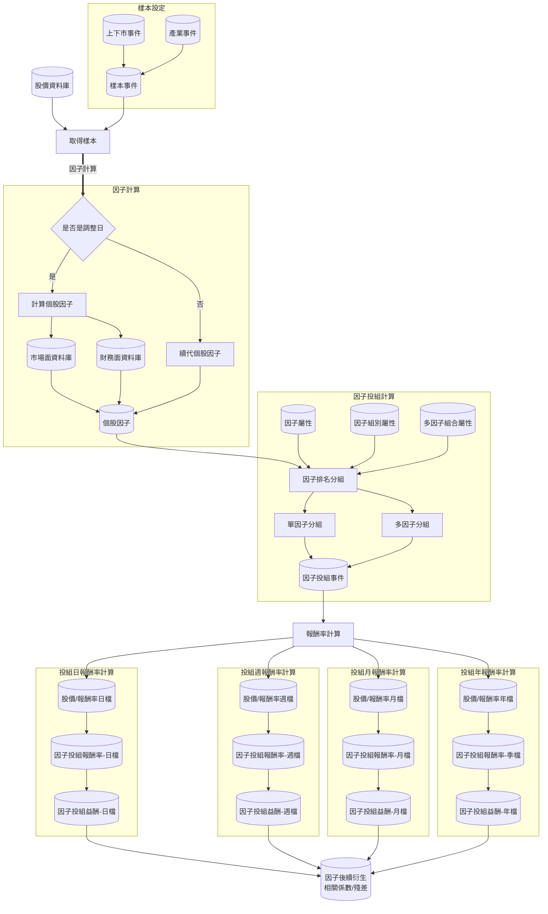

# 多因子衍生流程
### 產出檔
1. 樣本事件
2. 個股因子
3. 因子投組事件
4. 因子投組報酬率:日/週/月/年
5. 因子投組益酬:日/週/月/年

```mermaid
flowchart TD

wrk1[取得樣本]
wrk2[計算個股因子]
wrk3[續代個股因子]
wrk4[因子排名分組]
wrk5[單因子分組]
wrk6[多因子分組]
wrk7[報酬率計算]
cond1{是否是調整日}
src1[(上下市事件)]
src2[(產業事件)]
src3[(市場面資料庫)]
src4[(財務面資料庫)]
src5[(股價資料庫)]
src6[(因子屬性)]
src7[(因子組別屬性)]
src8[(多因子組合屬性)]
src9[(股價/報酬率日檔)]
src10[(股價/報酬率週檔)]
src11[(股價/報酬率月檔)]
src12[(股價/報酬率年檔)]
tb1[(樣本事件)] 
tb2[(個股因子)]
tb3[(因子投組事件)]
tb4[(因子投組報酬率-日檔)]
tb5[(因子投組報酬率-週檔)]
tb6[(因子投組報酬率-月檔)]
tb7[(因子投組報酬率-季檔)]
tb8[(因子投組益酬-日檔)]
tb9[(因子投組益酬-週檔)]
tb10[(因子投組益酬-月檔)]
tb11[(因子投組益酬-年檔)]
tbn[(因子後續衍生<br>相關係數/殘差)]

subgraph  樣本設定
    src1-->tb1
    src2-->tb1            
end
src5 & tb1-->wrk1==因子計算==>cond1    

subgraph  因子計算
    cond1 --是--> wrk2--> src3 & src4 -->tb2            
    cond1  --否-->wrk3 -->tb2  
end
subgraph 因子投組計算
    tb2 & src6 & src7 & src8-->wrk4-->wrk5 & wrk6 -->tb3
end
tb3-->wrk7--> src9 & src10 & src11 & src12
subgraph 投組日報酬率計算
    src9 -->tb4 -->tb8
end
subgraph 投組週報酬率計算
    src10 -->tb5 -->tb9
end
subgraph 投組月報酬率計算
    src11 -->tb6-->tb10
end
subgraph 投組年報酬率計算
    src12 -->tb7-->tb11
end

tb8 & tb9 & tb10 & tb11 --> tbn
```
